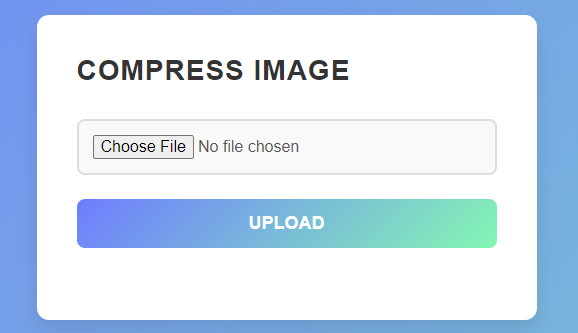

# Pixels-sous-pression  
Optimized image loading for web apps using advanced compression algorithms, enhancing performance and user experience. Developed for the *La Nuit de l'Info Challenge 2024*. Includes detailed documentation on the algorithms and performance improvements.



## Setup
1. Create a Python virtual environment and activate it:

   ```bash
   python -m venv venv
   ```

2. Activate the environment (Linux/MacOS):

   ```bash
   source venv/bin/activate
   ```

3. Install dependencies:

   ```bash
   pip install -r requirements.txt
   ```

## Usage
1. Run the FastAPI server:

   ```bash
   fastapi run app/server.py
   ```

2. Upload an image and watch it be compressed with minimal loss, optimizing performance.